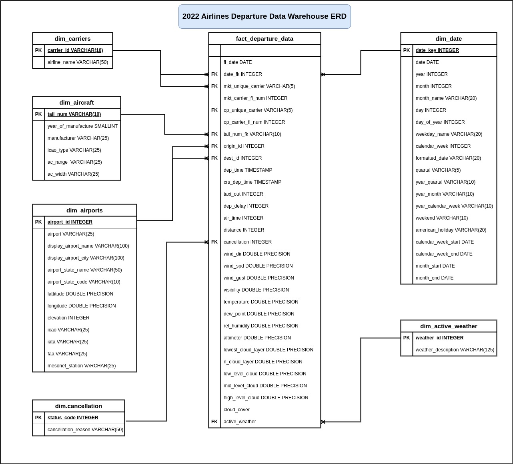

# 2022 Airlines Departure Data Warehouse in PostgreSQL

## 📌 Overview

This project demonstrates the design of the 2022 Airlines Departure Data Warehouse using PostgreSQL. It is modeling historical U.S. domestic departure flight data into a query-optimized data warehouse following using dimensional modeling (star schema) approach. The goal of this project is to transform raw CSV files into a datawarehous that supports efficient querying, reporting, and analytics for airline deparure operations and performance metrics. The project uses the Medallion Architecture which organizes data processing into layered zones — Bronze, Silver, and Gold.

## 🧱 Architecture Layers

### Bronze Layer
- Raw flight, , cancellation, carrier, weather, and airport data stored in CSV files
- Data stored in staging tables in the bronze schema without transformation.
- Preserving raw data.

### Silver Layer
- Data validation, cleansing and transormation, when needed. 
- The raw data is already relatively clean, so minimal transformation was applied.
- Purpose is refining data quality and apply consistent formatting and ensure atomicity.

### Gold Layer
- Creating and loading data into dimension and fact tables.
- Follows a star schema structure for business intelligence, reporting, and analytics.
- Creating indexes to increase query performance.
- Date dimension table added to support time based aggregation.

## 🗃️ ERD Diagram

## 🧰 Tech Stack
- **PostgreSQL**
- **SQL**

## 🔗 References

- Kaggle - 2022 US Airlines Domestic Departure Data
  https://www.kaggle.com/datasets/jl8771/2022-us-airlines-domestic-departure-data

- PostgreSQL Documentation
  https://www.postgresql.org/docs/

✅ This project uses only publicly available data for educational purposes.
